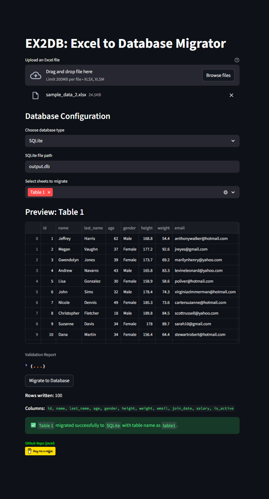

# EX2DB: Excel to Database Migrator

EX2DB is a Python tool that simplifies the migration of Excel spreadsheets to databases. It supports multiple database engines and includes a Streamlit UI for visual, user-friendly migration.

---

### What EX2DB Does?

- ✅ Load `Excel` files
- ✅ Clean and standardize column names and data types
- ✅ Validate missing values, duplicates, and schema consistency
- ✅ Infer SQL schema and write to SQLite, PostgreSQL, MySQL, or Oracle
- ✅ Streamlit UI for visual migration and preview

---

### How to Use?

Using the Streamlit app

```bash
streamlit run app.py
```

Then:

1. Upload your Excel file
2. Configure your database connection
3. Preview cleaned data and validation reports
4. Migrate sheets with a single click

This this the preview of `EX2DB` Streamlit app.


_The sample data shown are not real and generated only by the [Faker](https://github.com/joke2k/faker) package._

---

### Core function 'migration' usage sample

```python
from core.migrator import migrate

report = migrate("data.xlsx", "sqlite:///output.db")
print(report)
```

Each sheet in the Excel file returns a dictionary entry with:

`"status":` "success" or "error"  
`"rows":` number of rows written  
`"columns":` list of column names  
`"validation":` summary of issues (missing values, duplicates, etc.)  
`"table":` final table name used in the database  
`"message":` error description (if any)

<a href="https://coff.ee/jncel">
  
</a>
