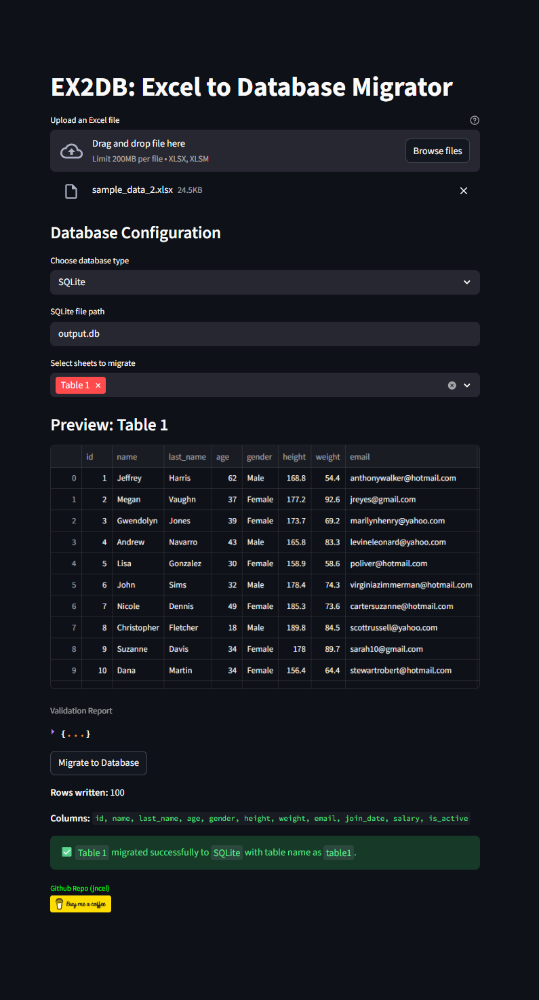

# EX2DB: Excel to Database Migrator

EX2DB is a modular Python package and Streamlit application designed to automate the process of migrating Excel spreadsheets into relational databases. It handles file parsing, data cleaning, quality validation, database schema inference, and data writing in a unified pipeline.

## Features

* **Loader**: Parses multi-sheet Excel files into pandas DataFrames.
* **Cleaner**: Standardizes column names (lower casing, replacing spaces and special characters with underscores) and cleans object column types.
* **Validator**: Checks for missing values, duplicates, and empty columns.
* **Schema Builder**: Maps pandas data types directly to SQLAlchemy data types and auto-detects primary keys (such as ID or UUID).
* **Connector and Writer**: Manages database connection lifecycles and safely commits data to target tables.
* **Streamlit UI**: Provides an interactive browser interface to preview cleaned data, inspect validation reports, and perform migrations visually.

## Supported Databases

* SQLite
* PostgreSQL
* MySQL
* Oracle

## Installation

1. Clone the repository:
   ```bash
   git clone https://github.com/j-ncel/ex2db.git
   cd ex2db
   ```

2. Create a virtual environment and activate it:
   ```bash
   python -m venv .venv
   # On Windows:
   .venv\Scripts\activate
   # On Unix/macOS:
   source .venv/bin/activate
   ```

3. Install the dependencies:
   ```bash
   pip install -r requirements.txt
   ```

## Getting Started

### Streamlit Application

To launch the web interface:
```bash
streamlit run app.py
```

Then:
1. Upload your Excel file.
2. Select your database type and fill in the connection details.
3. Choose the sheets you want to migrate.
4. Preview the cleaned data and schema mapping.
5. Click the migrate button to write to the database.



*The sample data shown are generated by the Faker package.*

### Programmatic Usage

You can use the high-level `Migrator` class to run migrations in your own Python scripts:

```python
from core.migrator import Migrator

# Initialize the migrator with the database connection URI
migrator = Migrator(db_uri="sqlite:///output.db")

# Run the migration for all sheets (or specific sheets)
report = migrator.migrate(file_path="data.xlsx")
print(report)
```

Each sheet in the Excel file returns a dictionary entry containing:
* `status`: "success" or "error"
* `rows`: number of rows written
* `columns`: list of column names
* `validation`: summary of data validation issues (missing values, duplicates, etc.)
* `table`: final table name used in the database
* `message`: error description (if status is "error")

### Advanced Usage (Component Level)

You can also use the individual modules for custom data processing pipelines:

```python
from excel.loader import ExcelLoader
from excel.cleaner import ExcelCleaner
from excel.validator import ExcelValidator

# Load data
loader = ExcelLoader("data.xlsx")
sheets = loader.load(sheet_names=["Sheet1"])
df = sheets["Sheet1"]

# Clean data
cleaner = ExcelCleaner(lowercase_columns=True, strip_whitespace=True)
df_clean = cleaner.clean(df)

# Validate data
validator = ExcelValidator(check_duplicates=True)
report = validator.validate(df_clean)
print("Validation report:", report)
```

## Running Tests

To run the test suite:
```bash
pip install -r dev-requirements.txt
pytest
```

<a href="https://coff.ee/jncel">
  
</a>
